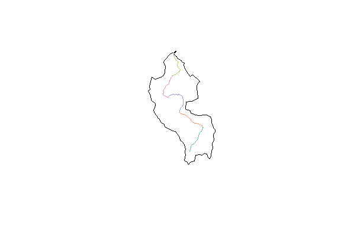
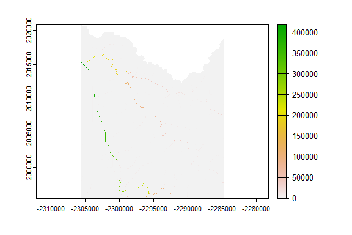
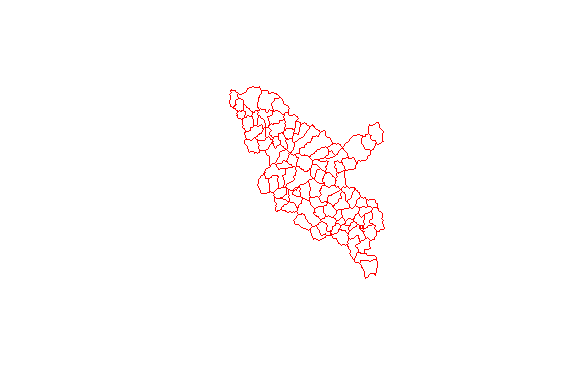
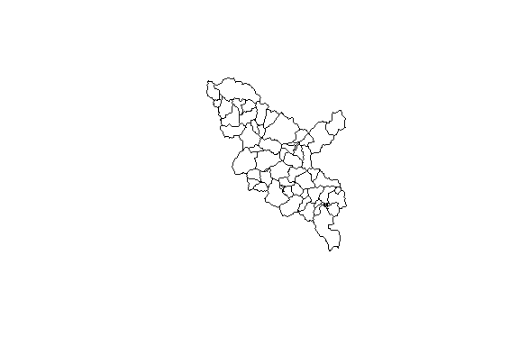
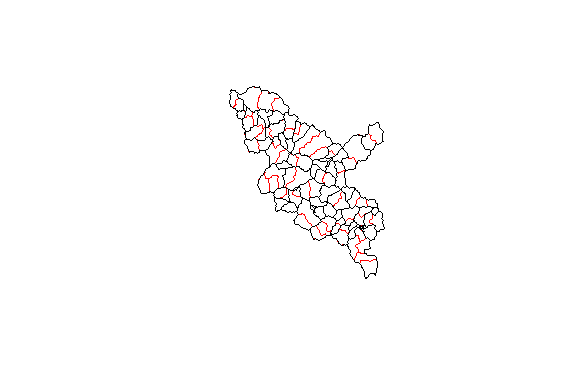
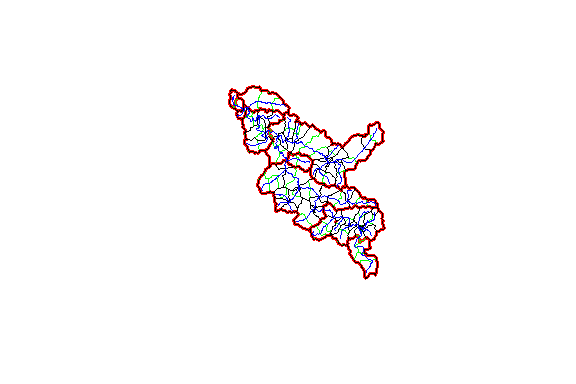

# Refactoring Catchments with NHDPlusTools

## Load Network and Refactor

For this example, we will use some data available from the nhdplusTools
package for testing and examples. `fac_sample`, `fdr_sample`,
`flowline_sample`, `catchment_sample` are all included as sample data in
`nhdplusTools`.

Before we can do anything with the catchments, we need to run the
NHDPlus Refactor workflow documented over in
`vignette("refactor_nhdplus")`.

    library(sf)
    #> Linking to GEOS 3.9.1, GDAL 3.4.3, PROJ 7.2.1; sf_use_s2() is TRUE
    library(nhdplusTools)
    #> USGS Support Package: https://owi.usgs.gov/R/packages.html#support
    library(hyRefactor)
    #> Registered S3 method overwritten by 'geojsonlint':
    #>   method         from 
    #>   print.location dplyr

    source(system.file("extdata", "walker_data.R", package = "hyRefactor"))
    #> terra 1.6.7

    fac <- walker_fac@ptr$filenames
    fdr <- walker_fdr@ptr$filenames

    ref <- tempfile(fileext = ".gpkg")
    rec <- tempfile(fileext = ".gpkg")

    refactor_nhdplus(nhdplus_flines = walker_flowline,
                     split_flines_meters = 2000,
                     collapse_flines_meters = 1000,
                     collapse_flines_main_meters = 1000,
                     split_flines_cores = 2,
                     out_refactored = ref,
                     out_reconciled = rec,
                     three_pass = TRUE,
                     purge_non_dendritic = FALSE,
                     warn = FALSE)

    flowline_ref <- read_sf(ref)
    flowline_rec <- read_sf(rec)

Let’s start by looking at a single sample catchment. In the first plot,
you can see the input is a single polygon and a set of catchment
flowlines. For reference, the Flow Direction Raster (FDR) and Flow
Accumulation Raster (FAC) are also plotted.

    sample_catchment <- dplyr::filter(walker_catchment, FEATUREID == 5329435)

    sample_flowline <- dplyr::filter(flowline_ref, as.integer(COMID) == 5329435)

    plot(st_geometry(sample_catchment))
    plot(sample_flowline["COMID"], add = TRUE)

    plot(walker_fdr)

    plot( walker_fac)

Now we can run the `split_catchment_divide()` function which is designed
to take one catchment and its associated (split) flowlines. The split
flowlines are the “refactored” but not “reconciled” output of the
`nhdplus_refactor()` function we ran above. Here we run the
`split_catchment()` function and plot up the resulting data to show what
it did.

    sample_catchment <- sf::st_transform(sample_catchment, 
                                         sf::st_crs(walker_fdr))
    sample_flowline <- sf::st_transform(sample_flowline, 
                                         sf::st_crs(walker_fdr))

    split_cat <- split_catchment_divide(sample_catchment, sample_flowline, walker_fdr,  walker_fac)

    plot(st_geometry(split_cat), col = NA, border = "red")
    plot(st_geometry(sample_catchment), add = TRUE)
    plot(sample_flowline["COMID"], lwd = 2, add= TRUE)

As you can see, the flowline in question was split into five pieces by
`nhdplus_refactor()` and the cooresponding catchment (black) was
similarly broken up into 5 sub-catchments (red).

The `split_catchment_divide()` function can be run against a set of
catchments using the `reconcile_catchment_divides()` function. This
functiona can call `split_catchment()` in parallel, unions catchments
according to the output of `nhdplus_refactor()`, and assembles the
results back into an `sf` `data.frame`.

    walker_catchment <- sf::st_transform(walker_catchment, sf::st_crs(walker_fdr))
    flowline_ref <- sf::st_transform(flowline_ref, sf::st_crs(walker_fdr))
    flowline_rec <- sf::st_transform(flowline_rec, sf::st_crs(walker_fdr))

    split_cats <- reconcile_catchment_divides(catchment = walker_catchment, 
                                              fline_ref = flowline_ref, 
                                              fline_rec = flowline_rec, 
                                              fdr = fdr, 
                                              fac = fac, 
                                              para = 4)

    plot(st_geometry(split_cats), col = NA, border = "red")

    plot(st_geometry(walker_catchment), col = NA, border = "black")

    plot(st_geometry(split_cats), col = NA, border = "red")
    plot(st_geometry(walker_catchment), col = NA, border = "black", add = TRUE)

## Aggregation

With our flowline network and catchments all refactored and the geometry
reconciled, we could also aggregate the resulting network to a selected
set of outlet locations.

    outlets <- data.frame(ID = c(31, 3, 5, 1, 45, 92),
                          type = c("outlet", "outlet", "outlet", "terminal", "outlet", "outlet"),
                          stringsAsFactors = FALSE)

    aggregated <- aggregate_catchments(flowpath = flowline_rec, 
                                       divide = split_cats,
                                       outlets = outlets)
    #> Fixing 1 missing outlets.
    #> Running 26 headwaters for 10 outlets.

    plot(aggregated$cat_sets$geom, lwd = 3, border = "red")
    plot(split_cats$geom, lwd = 1.5, border = "green", col = NA, add = TRUE)
    plot(walker_catchment$geom, lwd = 1, add = TRUE)
    plot(walker_flowline$geom, lwd = .7, col = "blue", add = TRUE)

    #'
    plot(aggregated$cat_sets$geom, lwd = 3, border = "black")
    plot(aggregated$fline_sets$geom, lwd = 3, col = "red", add = TRUE)
    plot(walker_flowline$geom, lwd = .7, col = "blue", add = TRUE)

## Splitting Catchments

The `split_catchment_divide()` function can be used in two ways. If
provided with multiple flowpaths per catchment boundary, it will split
catchments along their length. If provided one or more with the `lr`
parameter set to `TRUE`, it will also split each catchment into two
pieces along the flowpath. In headwater catchments, the left-right split
will extend upstream along the maximum upstream flow accumulation path
till it reaches the catchment divide. `split_catchment_divide()` is
called in the `refactor_nhdplus()` workflow but this left-right split is
not applied then. This next block shows how to apply the split to
aggregated results.

NOTE: left / right split is not function in v0.4.8

    split_catchments <- do.call(c, lapply(c(1:nrow(aggregated$cat_sets)), 
                                          function(g, ac, af, fdr, fac) {
                                            split_catchment_divide(ac[g, ], af[g, ], 
                                                                   fdr, fac, lr = FALSE)
                                          }, 
                                          ac = aggregated$cat_sets, 
                                          af = aggregated$fline_sets, 
                                          fdr = walker_fdr, 
                                          fac = walker_fac))

Here we see the split geometry in black and the original catchments in
red.

    plot(split_catchments, lwd = 3)
    plot(st_geometry(aggregated$cat_sets), lwd = 2, border = "red", add = TRUE)

Here we see the split geometry in black again with the flowline used for
the split in red.

    plot(split_catchments, lwd = 3)
    plot(aggregated$fline_sets$geom, lwd = 1, col = "red", add = TRUE)

## Identifiers

So you want to know how the identifiers from the original NHDPlus
Catchments relate to the output? Let’s look at what’s in the output.

    (input_ids <- walker_flowline$COMID)
    #>  [1] 5329303 5329293 5329305 5329317 5329315 5329339 5329343 5329357 5329365 5329373 5329385
    #> [12] 5329821 5329395 5329397 5329389 5329435 5329313 5329311 5329817 5329323 5329325 5329327
    #> [23] 5329347 5329291 5329363 5329819 5329359 5329333 5329371 5329375 5329377 5329379 5329399
    #> [34] 5329405 5329427 5329413 5329419 5329391 5329407 5329387 5329415 5329355 5329337 5329335
    #> [45] 5329345 5329341 5329321 5329841 5329815 5329319 5329309 5329307 5329299 5329297 5329295
    #> [56] 5329849 5329393 5329871 5329383 5329847 5329845 5329843

    (refactored_ids <- flowline_rec$ID)
    #>  [1]  1  2  3  4  5  6  7  8  9 10 11 12 13 14 15 16 17 18 19 20 21 22 23 24 25 26 27 28 29 30
    #> [31] 31 32 33 34 35 36 37 38 39 40 41 42 43 44 45 46 47 48 49 50 51 52 53 54 55 56 57 58 59 60
    #> [61] 61 62 63 64 65 66 67 68 69 70 71 72 73 74 75 76 77 78 79 80 81 82 83 84 85 86 87 88 89 90
    #> [91] 91 92 93

    (refactored_id_mapping <- flowline_rec$member_COMID)
    #>  [1] "5329303"                         "5329293,5329305.3"              
    #>  [3] "5329343"                         "5329373,5329843"                
    #>  [5] "5329385"                         "5329821"                        
    #>  [7] "5329397"                         "5329389,5329435.5"              
    #>  [9] "5329313"                         "5329311"                        
    #> [11] "5329323,5329325,5329327,5329321" "5329363"                        
    #> [13] "5329379,5329399"                 "5329405"                        
    #> [15] "5329391,5329393"                 "5329407"                        
    #> [17] "5329355"                         "5329335"                        
    #> [19] "5329341"                         "5329299"                        
    #> [21] "5329297"                         "5329849,5329383.2"              
    #> [23] "5329871,5329383.1"               "5329847"                        
    #> [25] "5329845,5329415.2"               "5329305.1"                      
    #> [27] "5329305.2"                       "5329317.1"                      
    #> [29] "5329317.2"                       "5329317.3"                      
    #> [31] "5329315.1"                       "5329315.2"                      
    #> [33] "5329339.1"                       "5329339.2"                      
    #> [35] "5329339.3"                       "5329357.1"                      
    #> [37] "5329357.2"                       "5329365.1"                      
    #> [39] "5329365.2"                       "5329395.1"                      
    #> [41] "5329395.2"                       "5329435.1"                      
    #> [43] "5329435.2"                       "5329435.3"                      
    #> [45] "5329435.4"                       "5329817.1"                      
    #> [47] "5329817.2"                       "5329817.3"                      
    #> [49] "5329347.1"                       "5329347.2"                      
    #> [51] "5329291.1"                       "5329291.2"                      
    #> [53] "5329291.3"                       "5329819.1"                      
    #> [55] "5329819.2"                       "5329359.1"                      
    #> [57] "5329359.2"                       "5329359.3"                      
    #> [59] "5329333.1"                       "5329333.2"                      
    #> [61] "5329371.1"                       "5329371.2"                      
    #> [63] "5329371.3"                       "5329375.1"                      
    #> [65] "5329375.2"                       "5329377.1"                      
    #> [67] "5329377.2"                       "5329427.1"                      
    #> [69] "5329427.2"                       "5329427.3"                      
    #> [71] "5329413.1"                       "5329413.2"                      
    #> [73] "5329419.1"                       "5329419.2"                      
    #> [75] "5329387.1"                       "5329387.2"                      
    #> [77] "5329415.1"                       "5329337.1"                      
    #> [79] "5329337.2"                       "5329345.1"                      
    #> [81] "5329345.2"                       "5329841.1"                      
    #> [83] "5329841.2"                       "5329815.1"                      
    #> [85] "5329815.2"                       "5329319.1"                      
    #> [87] "5329319.2"                       "5329309.1"                      
    #> [89] "5329309.2"                       "5329307.1"                      
    #> [91] "5329307.2"                       "5329295.1"                      
    #> [93] "5329295.2"

    (aggregated_ids <- aggregated$cat_sets$ID)
    #>  [1]  1  2  3  5 31 45 53 79 92 93

    (aggregated_id_mapping <- aggregated$cat_sets$set)
    #> [[1]]
    #> [1] 1
    #> 
    #> [[2]]
    #>  [1] 21 20 26 27  2 32 28 29 30 59 60
    #> 
    #> [[3]]
    #>  [1] 17 54 55 12 38 39 36 37  3 56 57 58 61 62 63 66 67 64 65 24  4 14 77 25 13
    #> 
    #> [[4]]
    #>  [1] 75 76  7 40 41  6  5 16 71 72 73 74 68 69 70  8 23 22 15
    #> 
    #> [[5]]
    #>  [1] 90 91  9 31 88 89 10 86 87 46 47 48 33 34 35 19 18 80 81 49 50 84 85 82 83 11
    #> 
    #> [[6]]
    #> [1] 42 43 44 45
    #> 
    #> [[7]]
    #> [1] 51 52 53
    #> 
    #> [[8]]
    #> [1] 78 79
    #> 
    #> [[9]]
    #> [1] 92
    #> 
    #> [[10]]
    #> [1] 93

This may look like a complicated mess but there’s structure here.
Stepping through the identifiers, we have:

1.  NHDPlusV2 COMIDs (shared between catchment divides and flowlines)
2.  Refactored Catchment Identifiers (shared between catchment divides
    and flowpaths)

There are two caveats here.

1.  Because the source NHDPlusV2 catchments were split, the relationship
    between refactored catchments and source catchments requires a
    sequence (.1, .2, .. .10, etc. – upstream to downstream) to
    differentiate the parts.
2.  Aggregated catchments use the identifer of the outlet catchment.

Given these caveats, we can build a complete lookup table from source
catchment to output aggregate identifier.

    refactor_lookup <- dplyr::select(st_drop_geometry(flowline_rec), ID, member_COMID) %>%
      dplyr::mutate(member_COMID = strsplit(member_COMID, ",")) %>%
      hyRefactor:::unnest_flines(col = "member_COMID") %>%
      dplyr::mutate(NHDPlusV2_COMID = as.integer(member_COMID)) %>% # note as.integer truncates
      dplyr::rename(reconciled_ID = ID)

    aggregate_lookup_fline <- dplyr::select(st_drop_geometry(aggregated$fline_sets), ID, set) %>%
      hyRefactor:::unnest_flines() %>%
      dplyr::rename(aggregated_flowline_ID = ID, reconciled_ID = set)

    aggregate_lookup_catchment <- dplyr::select(st_drop_geometry(aggregated$cat_sets), ID, set) %>%
      hyRefactor:::unnest_flines() %>%
      dplyr::rename(aggregated_catchment_ID = ID, reconciled_ID = set)

    (lookup_table <- tibble::tibble(NHDPlusV2_COMID = input_ids) %>%
      dplyr::left_join(refactor_lookup, by = "NHDPlusV2_COMID") %>%
      dplyr::left_join(aggregate_lookup_fline, by = "reconciled_ID") %>%
      dplyr::left_join(aggregate_lookup_catchment, by = "reconciled_ID"))
    #> # A tibble: 104 × 5
    #>    NHDPlusV2_COMID reconciled_ID member_COMID aggregated_flowline_ID aggregated_catchment_ID
    #>              <int>         <int> <chr>                         <int>                   <int>
    #>  1         5329303             1 5329303                           1                       1
    #>  2         5329293             2 5329293                           2                       2
    #>  3         5329305             2 5329305.3                         2                       2
    #>  4         5329305            26 5329305.1                         2                       2
    #>  5         5329305            27 5329305.2                         2                       2
    #>  6         5329317            28 5329317.1                         2                       2
    #>  7         5329317            29 5329317.2                         2                       2
    #>  8         5329317            30 5329317.3                         2                       2
    #>  9         5329315            31 5329315.1                        31                      31
    #> 10         5329315            32 5329315.2                         2                       2
    #> # … with 94 more rows

Ta Da!! Have fun and [report bugs
here](https://github.com/dblodgett-usgs/nhdplusTools/issues).
