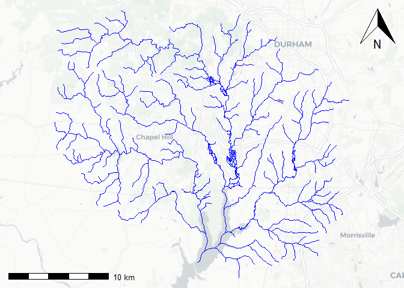
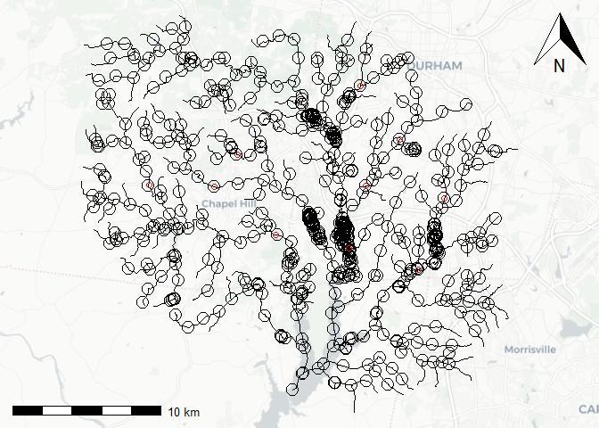

A complete refactor workflow is presented in
`vignette("refactor_nhdplus")`. This article is used to describe the
split-flowlines step in detail. The split flowlines functionality is
intended to support either splitting flowlines that are too long at
arbitrary locations or splitting flowlines at specific locations such as
stream gages or particular model-output locations.

We’ll use the sample “New Hope” watershed included in the package and
prepare it for processing with `nhdplusTools::prepare_nhdplus()`

    source(system.file("extdata", "new_hope_data.R", package = "hyRefactor"))

    new_hope_flowline <- dplyr::right_join(dplyr::select(new_hope_flowline, COMID, REACHCODE, FromMeas, ToMeas), 
                                    suppressWarnings(nhdplusTools::prepare_nhdplus(new_hope_flowline, 
                                                                     0, 0, 0, FALSE, warn = FALSE)), 
                                    by = "COMID")

    nhdplusTools::plot_nhdplus(outlets = new_hope_flowline$COMID, nhdplus_data = file.path(extdata, "new_hope.gpkg"), flowline_only = TRUE)

    ## Warning in showSRID(uprojargs, format = "PROJ", multiline = "NO", prefer_proj = prefer_proj):
    ## Discarded ellps WGS 84 in Proj4 definition: +proj=merc +a=6378137 +b=6378137 +lat_ts=0 +lon_0=0
    ## +x_0=0 +y_0=0 +k=1 +units=m +nadgrids=@null +wktext +no_defs

    ## Warning in showSRID(uprojargs, format = "PROJ", multiline = "NO", prefer_proj = prefer_proj):
    ## Discarded datum WGS_1984 in Proj4 definition

    ## Zoom: 11

    ## Map tiles by Carto, under CC BY 3.0. Data by OpenStreetMap, under ODbL.

    ## Audotdetect projection: assuming Google Mercator (epsg 3857)

    split <- hyRefactor::split_flowlines(suppressWarnings(sf::st_cast(sf::st_transform(new_hope_flowline, 5070), "LINESTRING")), 
                             max_length = 2000, events = new_hope_events)

    split_outlets <- sf::st_sf(sf::st_drop_geometry(split), geom = sf::st_geometry(nhdplusTools::get_node(split, position = "end")))

    plt <- function(x) sf::st_geometry(sf::st_transform(x, 3857))

    nhdplusTools::plot_nhdplus(outlets = new_hope_flowline$COMID, nhdplus_data = file.path(extdata, "new_hope.gpkg"), flowline_only = TRUE)

    ## Zoom: 11

    ## Map tiles by Carto, under CC BY 3.0. Data by OpenStreetMap, under ODbL.

    ## Audotdetect projection: assuming Google Mercator (epsg 3857)

    plot(plt(split), add = TRUE)
    plot(plt(split_outlets), add = TRUE, cex = 2)
    plot(plt(new_hope_events), add = TRUE, cex = 1, col = "red")

